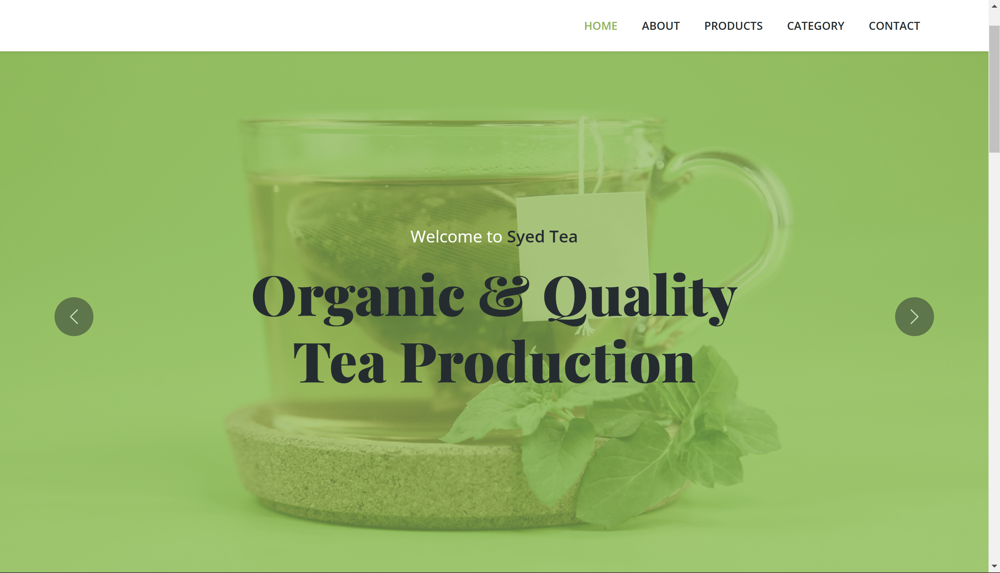
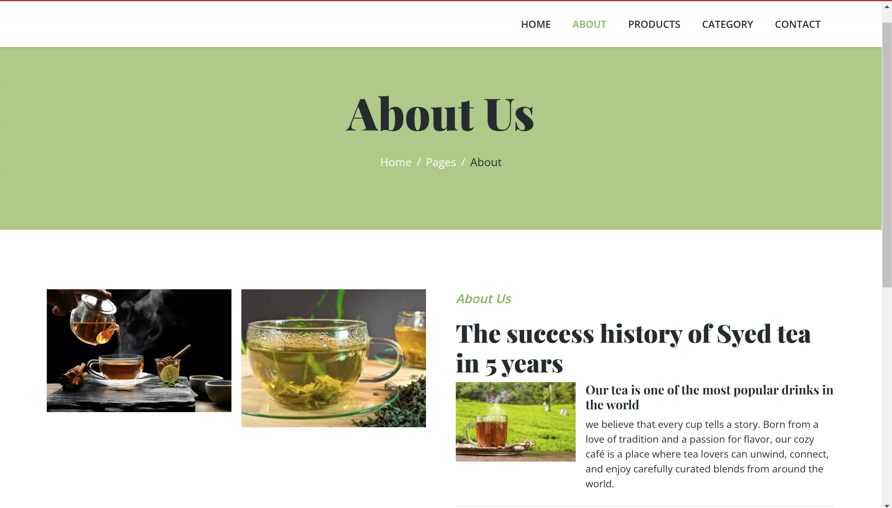
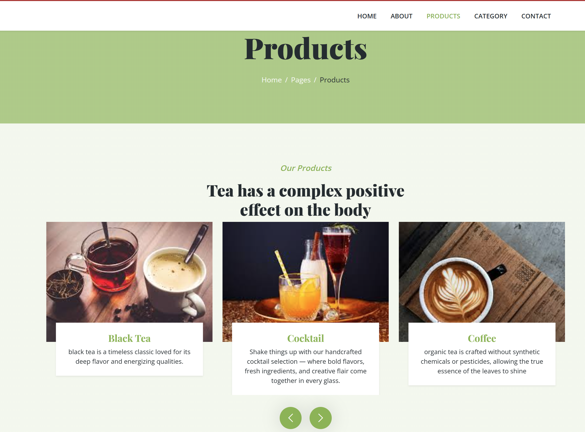
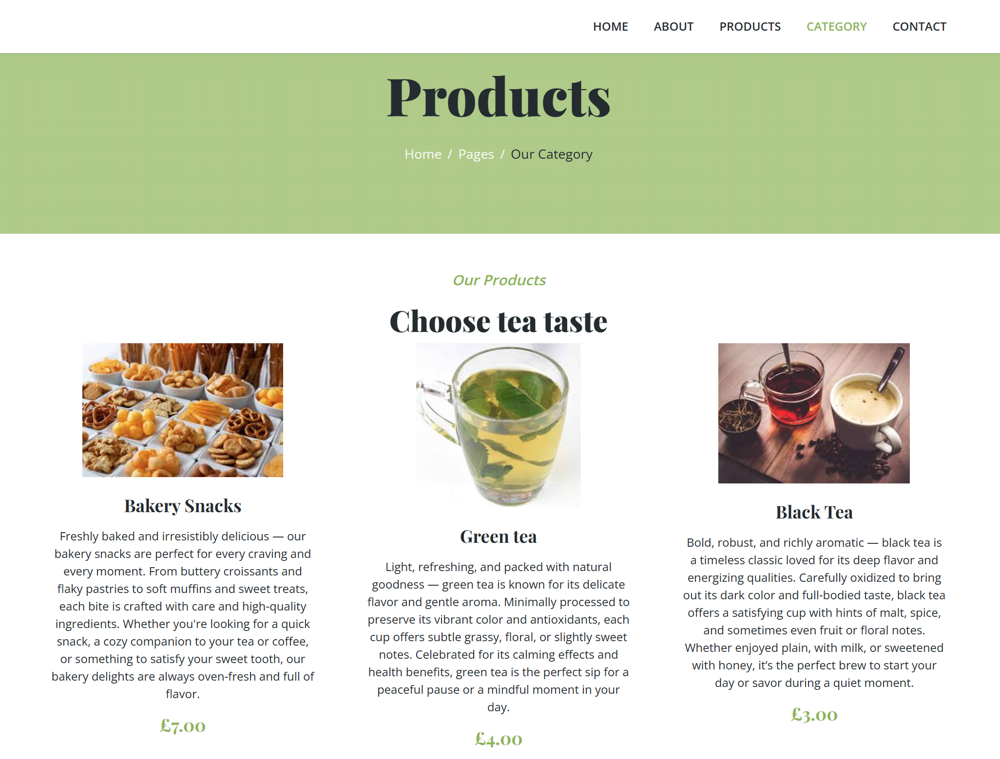
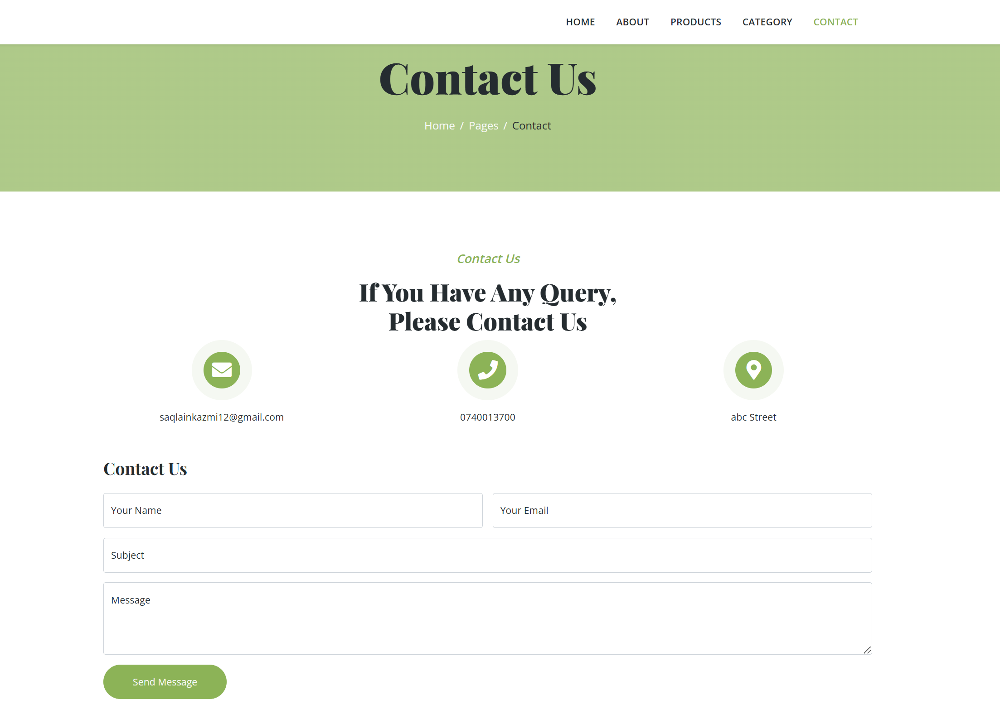
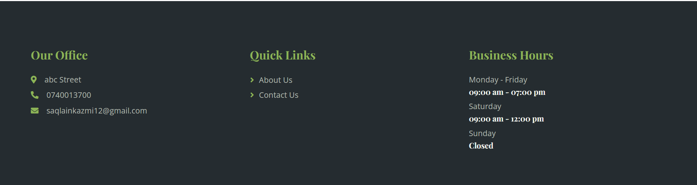

# Welcome To My Teashop

## Table of Contents

1. [Overview](#overview)
2. [Live Site](#live-site)
3. [Features](#features)
4. [Demo](#demo)
5. [Technologies Used](#technologies-used)
6. [Installation](#installation)

## Overview
This project simulates a local tea business website where customers can view the menu, explore different tea varieties, and learn about the business.

This project is a visually appealing web layout using HTML, CSS, and JS. It features responsive design, interactive card elements with hover effects, and a modern button and a hamburger menu. The layout is designed to adapt to various screen sizes, making it mobile-friendly.

## Live Site
Visit the live demo:  https://syedkazmidev.github.io/Tea-project/

## Features

- **Tea Menu**: A section to display a variety of teas and beverages.
- **Contact Form**: Allows customers to easily get in touch.
- **Responsive Design**: Fully responsive layout that works on desktop and mobile devices.
- **JavaScript**: Allows for further interactivity such as sliders/carousel.

## Demo

## Technologies Used

- **HTML**: Basic structure for the page.
- **CSS**: Styling for the page, including layout, typography, and interactive effects.
- **JavaScript**: Adds interactivity to the page, dynamic content updates, and other interactive features.

## Installation

To get started, follow these steps:

1. Clone this repository in gitbash:
   git clone https://github.com/SyedKazmiDev/Tea-project.git
2. To check, navigate to the project folder in file explorer and Click on index.html to open in browser.

